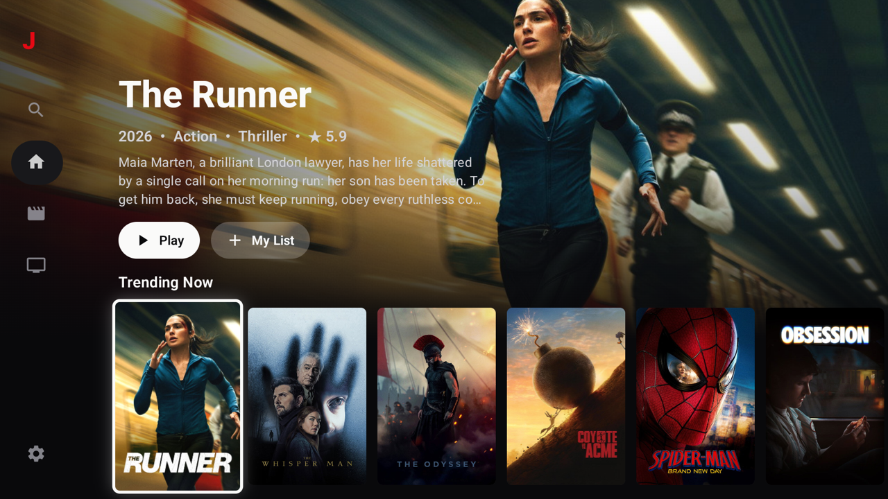
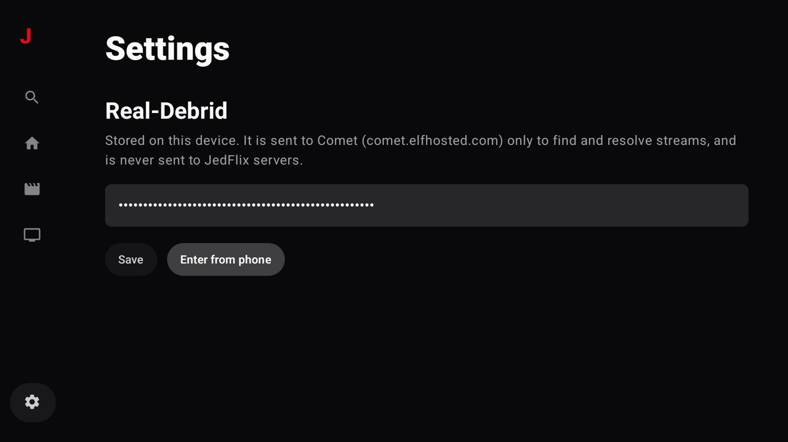
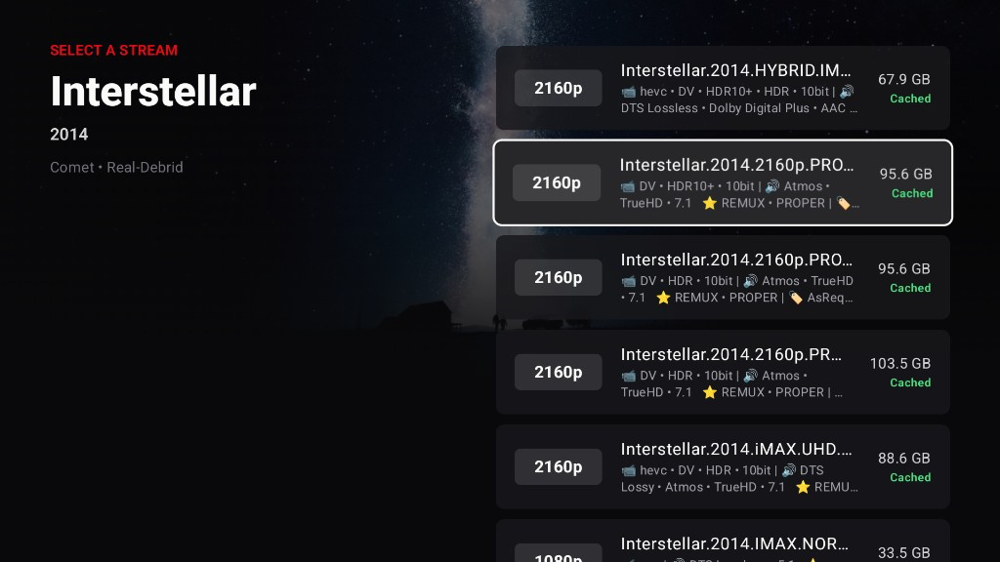

# JedFlix TV

Android TV / Google TV client for [JedFlix](https://github.com/JedBorseth/jedflix). 

Kotlin, Jetpack Compose for TV, Coil, Retrofit, Media3. Catalog from TMDB; playback through Real-Debrid.



**[Download APK](https://github.com/JedBorseth/jedflix-tv/releases/tag/v0.1.0)** · Leanback, API 24+ · sideload only (not on Play Store)


|          |                                                            |
| -------- | ---------------------------------------------------------- |
| Browse   | Home / Movies / Shows, immersive billboard, poster shelves |
| Search   | Debounced as you type                                      |
| Title    | Detail, cast, similar, TV episodes                         |
| Play     | Title → stream picker → Comet cached RD links → Media3     |
| Library  | Local profiles, My List, continue watching, search recents |
| Settings | Real-Debrid key on-device (type or QR from phone)          |


The RD key stays in DataStore on the TV. It is sent only to [Comet](https://comet.elfhosted.com) to find/unrestrict streams — never to Convex or JedFlix web.

## Todo

- Subtitles
- More settings
- Alternate debrid providers (resell TorBox in-app)
- Actor pages
- More

## Install

1. Get a [Real-Debrid](https://real-debrid.com) premium key.
2. Install the APK (`adb install jedflix-tv-0.1.0-beta.apk`, or copy onto the TV).
3. Settings → paste the key, or **Enter from phone** and scan the QR.


## Build

```properties
# local.properties (gitignored)
sdk.dir=/Users/you/Library/Android/sdk
TMDB_API_KEY=your_tmdb_v3_key
```

```bash
./gradlew :app:installDebug
```

Maestro (with e.g. `GoogleTV_1080p` running): `maestro test .maestro/home.yaml`