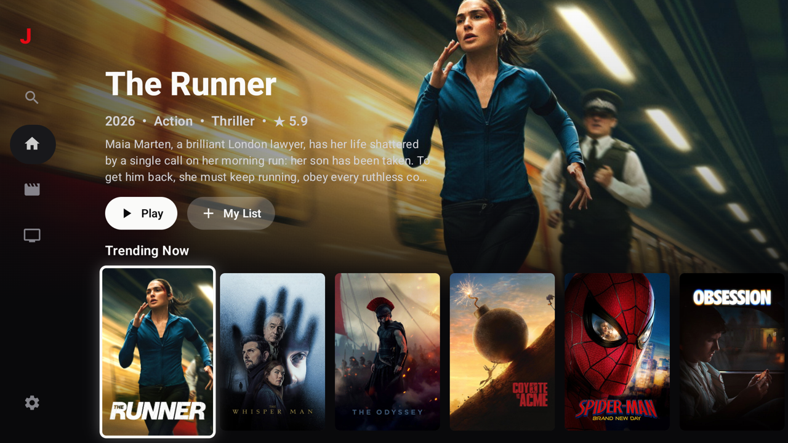
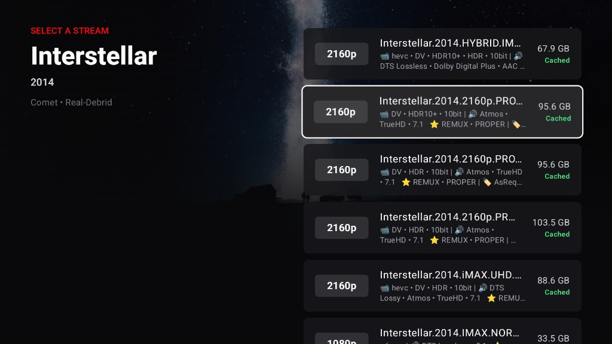

# JedFlix TV

Android TV / Google TV client for [JedFlix](https://github.com/JedBorseth/jedflix). 

Kotlin, Jetpack Compose for TV, Coil, Retrofit, Media3. Catalog from TMDB; playback through Real-Debrid.



**[Download APK](https://github.com/JedBorseth/jedflix-tv/releases/tag/v0.7.0)** · Leanback, API 24+ · sideload only (not on Play Store)


|          |                                                            |
| -------- | ---------------------------------------------------------- |
| Browse   | Home / Movies / Shows / Live TV, Trending billboard, deduplicated discovery, For You and Because you watched shelves |
| Search   | Debounced as you type                                      |
| Title    | Detail, cast, similar, TV episodes                         |
| Play     | Best-first English stream selection, Switch stream picker, TV chrome, captions, audio tracks, binge autoplay |
| Library  | Local profiles, My List, continue watching, search recents, Like and Not interested |
| Settings | Real-Debrid key on-device (type or QR from phone); Home shelf order and visibility; browse quality; version and in-app APK updates |


The RD key stays in DataStore on the TV. It is sent only to [Comet](https://comet.elfhosted.com) to find/unrestrict streams — never to JedFlix web.

Home recommendations run on the Linux server using a small CPU embedding model. The TV sends a bounded summary of title IDs, viewing progress, actual viewing time, My List, and feedback. Profile names, device IDs, and credentials are excluded. Profiles and recommendation caches remain local; the server persists public title metadata and embeddings, with brief response caching in memory. See [server setup](server/README.md#personalized-discovery).

Home hides unreleased movies and holds recent theatrical-only movies for 30 days, allowing earlier home releases, Canada-first streaming/rental/purchase availability, or recent successful playback. Metadata availability is an estimate; stream selection still happens on Play.

For older TVs, select **Settings → Browse quality → Low**. It uses smaller images, disables trailer previews, and keeps a clear focus border without poster scaling or glow. Viewing-time recording uses existing player save checkpoints and adds no timer or poster-focus writes.

## Todo

- More settings
- Alternate debrid providers (resell TorBox in-app)
- Actor pages
- More

## Install

1. Get a [Real-Debrid](https://real-debrid.com) premium key.
2. Install the APK (`adb install jedflix-tv-0.7.0.apk`, or copy onto the TV).
3. Settings → paste the key, or **Enter from phone** and scan the QR.

Later releases are offered in Settings (**Check for updates**, then **Download and install**). The app also checks GitHub once every 24 hours. Sideloaded updates only succeed when the new APK is signed with the same key as the installed build.


## Build

```properties
# local.properties (gitignored)
sdk.dir=/Users/you/Library/Android/sdk
TMDB_API_KEY=your_tmdb_v3_key
TRAILER_CLIP_BASE_URL=https://borseth.ddns.net/tv-api/clips
```

```bash
./gradlew :app:installDebug
```

Maestro (with e.g. `GoogleTV_1080p` running): `maestro test .maestro/home.yaml`
